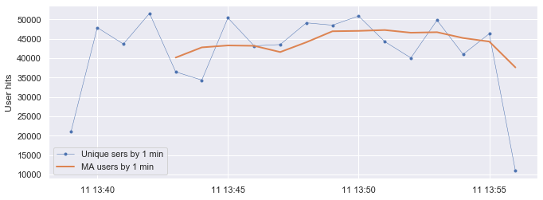

```python
import pandas as pd
import numpy as np
```

#### Read a csv file into a data frame


```python
#sample frame
#csvf="/tmp/stream_sample.csv"
#prd frame
csvf="/tmp/stream_prd.csv"
```


```python
df = pd.read_csv(csvf,header='infer')
```


```python
df.shape  # we have 1 M rows, the size of the generated dataset
```


    (1000000, 2)


#### convert epoch time in dateime, sort and set datetime column as data frame's index


```python
#convert epoch to datetime (epoch timestamps are in seconds)
df['datetime'] = pd.to_datetime(df['epoch'],unit='s')
```


```python
df.sort_values(by='datetime',inplace=True,ascending=True)
df.reset_index(inplace=True)
#df.tail(20)
```


```python
dff=df.set_index('datetime')
dff.drop(['index','epoch'], axis=1,inplace=True)
#verify
#dff.tail(10)
```

#### resample dataframe to 1 min period and count unique values in each bucket


```python
#getting the count of uniques per 1M
dfm1=dff.resample('1T').nunique()
dfm1.rename(columns={'uid': 'unique_ids'},inplace=True)
#verify
#dff.loc[dff.index>=pd.Timestamp('2016-07-11 13:40:00'),'uid'].nunique()
```


```python
dfm1.shape # we just have 18 distinct minutes
```


    (18, 1)


```python
dfm1.head(5)
```


<div>
<style scoped>
    .dataframe tbody tr th:only-of-type {
        vertical-align: middle;
    }

    .dataframe tbody tr th {
        vertical-align: top;
    }

    .dataframe thead th {
        text-align: right;
    }
</style>
<table border="1" class="dataframe">
  <thead>
    <tr style="text-align: right;">
      <th></th>
      <th>unique_ids</th>
    </tr>
    <tr>
      <th>datetime</th>
      <th></th>
    </tr>
  </thead>
  <tbody>
    <tr>
      <th>2016-07-11 13:39:00</th>
      <td>21158</td>
    </tr>
    <tr>
      <th>2016-07-11 13:40:00</th>
      <td>47904</td>
    </tr>
    <tr>
      <th>2016-07-11 13:41:00</th>
      <td>43659</td>
    </tr>
    <tr>
      <th>2016-07-11 13:42:00</th>
      <td>51580</td>
    </tr>
    <tr>
      <th>2016-07-11 13:43:00</th>
      <td>36472</td>
    </tr>
  </tbody>
</table>
</div>


#### Visualize unique users values and its rolling mean


```python
import matplotlib.pyplot as plt
import seaborn as sns
```


```python
fig,ax = plt.subplots()
ax.plot(dfm1['unique_ids'], marker='.',linestyle='-', linewidth=0.5, label='Unique sers by 1 min')
ax.plot(dfm1.rolling(5).mean(), linestyle='-', linewidth=2.0, label='MA users by 1 min')
ax.set_ylabel('User hits')
ax.legend();
```





##### The plot shows that a first and last value in a User Hits serie should be discarded as they do not gather fulll statistics per minute


```python
#dff.resample('1H').nunique()
```
